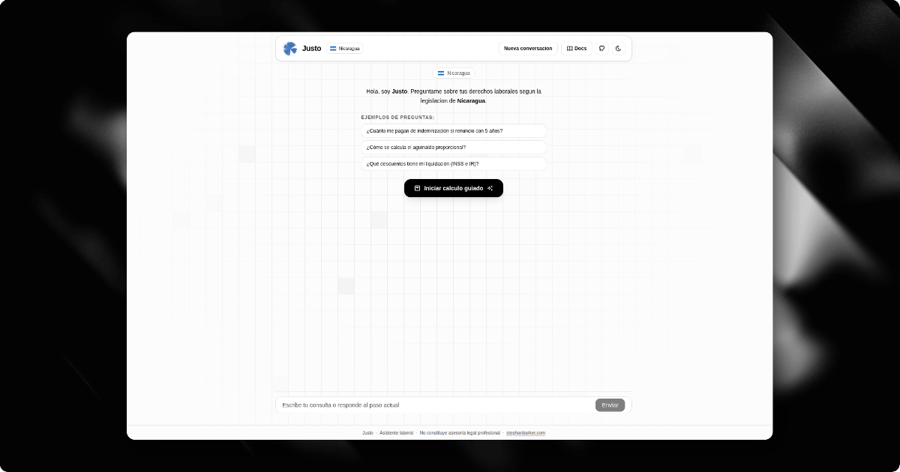

# Justo



<p align="center">
  <a href="LICENSE"></a>
  
  
  
</p>

<p align="center">
  <strong>🌐 Languages</strong><br />
  <a href="README.md">Español</a> · <a href="README.en.md"><strong>English</strong></a>
</p>

<p align="center">
  <strong>Open-source labor assistant for Central America and Latin America</strong><br />
  AI labor chat + open-source labor tools + deterministic calculations + country-specific legal traceability.
</p>

---

## What Is Justo

Justo helps workers understand labor rights and estimate settlements with clear explanations, verifiable formulas, and references to the selected country's legal corpus.

The product separates two responsibilities:

- **AI chat**: guides, answers labor questions, and explains concepts using the legal corpus.
- **OSS labor tools**: open calculators, documents, and checklists registered in `packages/tools`.
- **Deterministic engine**: does not use AI for calculations. Amounts are generated by deterministic logic in `packages/core`, organized by jurisdiction.

> Justo is informational and does not replace professional legal advice.

---

## Features

| | Functionality |
|---|---|
| 🤖 | **AI labor chat** — Answers questions about rights, benefits, severance, vacation, bonuses, and deductions with references to the legal corpus. |
| 🧰 | **OSS tools marketplace** — `/tools` lists open labor tools, available and upcoming. |
| 🧮 | **Deterministic calculator** — Calculates settlements on the server with explicit country rules; the model does not invent legal arithmetic. |
| 🌎 | **11 supported countries** — Nicaragua, Guatemala, El Salvador, Honduras, Costa Rica, Panama, Mexico, Colombia, Peru, Argentina, and Chile. |
| 📄 | **Printable PDF** — Report with summary, income, deductions, net total, corpus version, legal notice, and signature lines. |
| ⚖️ | **Legal traceability** — Each concept can include formula, legal reference, and legal corpus version. |
| 💬 | **Rich responses** — Safe Markdown, compact tables, formulas, legal sources, and mobile-optimized notices. |
| 🔒 | **Privacy by default** — No user accounts or case persistence by default. Avoiding PII in production logs is part of the project contract. |
| 📊 | **Optional analytics** — Self-hosted Plausible can be enabled through public environment variables; it is disabled by default. |
| 🌙 | **Light/dark theme** — Responsive UI with system theme support. |

---

## How It Works

```text
  ┌─────────────────────────────────────────────────────────────┐
  │  1. Open the app and choose country/language                │
  │  2. Ask the chat or press "Start calculation"               │
  │  3. Capture salary, dates, vacation, and payment frequency  │
  │  4. Confirm inputs before calculating                       │
  │  5. Get breakdown, formulas, sources, and PDF               │
  └─────────────────────────────────────────────────────────────┘
```

1. **Country selection** — The app lets users choose a jurisdiction and generates localized routes such as `/es/ni` or `/en/ni`.
2. **Labor chat** — The user asks labor questions. The AI must use the legal corpus and ask only for missing data when needed.
3. **Guided calculation** — The flow captures minimum inputs: worker, employer, monthly salary, dates, pending vacation, and payment frequency.
4. **Deterministic calculation** — The server runs the corresponding country engine from `packages/core/src/settlement/{country}/`.
5. **Result and PDF** — The app shows estimated net total, income, deductions, formulas, and a downloadable PDF.

---

## Supported Countries

| Country | Code | Currency | Base legislation | Version |
|---|---|---|---|---|
| Nicaragua | `ni` | NIO | Law No. 185 | `ni-v0.2.0` |
| Guatemala | `gt` | GTQ | Decree 1441 | `gt-v0.1.0` |
| El Salvador | `sv` | USD | Labor Code | `sv-v0.1.0` |
| Honduras | `hn` | HNL | Decree 189-59 | `hn-v0.1.0` |
| Costa Rica | `cr` | CRC | Labor Code | `cr-v0.1.0` |
| Panama | `pa` | USD | Labor Code | `pa-v0.1.0` |
| Mexico | `mx` | MXN | Federal Labor Law | `mx-v0.1.0` |
| Colombia | `co` | COP | Substantive Labor Code | `co-v0.1.0` |
| Peru | `pe` | PEN | General Labor Law | `pe-v0.1.0` |
| Argentina | `ar` | ARS | Employment Contract Law 20.744 | `ar-v0.1.0` |
| Chile | `cl` | CLP | Labor Code | `cl-v0.1.0` |

---

## Tech Stack

- **Framework**: Next.js 16 + React 19
- **UI**: assistant-ui, Tailwind CSS v4, Radix UI
- **AI chat**: Vercel AI SDK v6 with OpenRouter or NVIDIA
- **Calculations**: Deterministic TypeScript by jurisdiction
- **Docs**: Fumadocs + MDX
- **PDF**: `pdf-lib`
- **Analytics**: Optional self-hosted Plausible with `@plausible-analytics/tracker`
- **Rate limiting/cache**: Upstash Redis optional/recommended in production
- **Validation**: Zod
- **Test runtime**: Bun

---

## Open Source Model

Justo uses a hybrid open-core model, but this public repository must remain useful by itself.

- **Open in this repo**: legal corpus, deterministic calculations, general labor tools, basic PDF, public app, and self-hosting.
- **Outside this repo for now**: internal HR assistant, professional case review package, Convex, billing, enterprise audit logs, and private integrations.
- **Product rule**: general labor tools are open source; future monetization comes from enterprise operations, not hiding legal formulas.

---

## Getting Started

### Requirements

- Node.js >= 22.6
- pnpm >= 10.18
- Bun >= 1.3

### Installation

```bash
pnpm install
```

### Environment Variables

Copy the example and configure your keys:

```bash
cp .env.example .env.local
```

Main variables:

| Variable | Description |
|---|---|
| `AI_PROVIDER` | Chat provider: `openrouter` or `nvidia`. |
| `OPENROUTER_API_KEY` | OpenRouter API key. |
| `OPENROUTER_BASE_URL` | OpenAI-compatible base URL. |
| `OPENROUTER_MODEL` | Chat model. |
| `NVIDIA_API_KEY` | NVIDIA API key if `AI_PROVIDER=nvidia`. |
| `NVIDIA_BASE_URL` | NVIDIA base URL. |
| `NVIDIA_MODEL` | NVIDIA model. |
| `NVIDIA_TEMPERATURE` | NVIDIA model temperature. |
| `NVIDIA_TOP_P` | NVIDIA model top-p. |
| `NVIDIA_MAX_OUTPUT_TOKENS` | Maximum output tokens. |
| `NVIDIA_THINKING_ENABLED` | Enables/disables reasoning if supported by the model. |
| `NVIDIA_REASONING_BUDGET` | Reasoning budget if applicable. |
| `NEXT_PUBLIC_APP_NAME` | Public app name. |
| `NEXT_PUBLIC_SITE_URL` | Canonical URL for SEO, sitemap, and metadata. |
| `UPSTASH_REDIS_REST_URL` | Redis REST URL for rate limiting/cache. |
| `UPSTASH_REDIS_REST_TOKEN` | Upstash REST token. |
| `STATS_RETENTION_DAYS` | Retention days for anonymous stats. |
| `NEXT_PUBLIC_PLAUSIBLE_ENABLED` | Enables Plausible if `true`. Default: `false`. |
| `NEXT_PUBLIC_PLAUSIBLE_DOMAIN` | Domain configured in Plausible. Leave empty until production. |
| `NEXT_PUBLIC_PLAUSIBLE_ENDPOINT` | Self-hosted event endpoint, e.g. `https://analytics.example.com/api/event`. Required when Plausible is enabled. |

### Run Locally

```bash
pnpm dev
```

Open `http://localhost:3000`.

---

## Project Structure

```text
apps/web/
├── app/
│   ├── [locale]/[country]/         # Localized country routes, e.g. /es/ni
│   ├── api/                        # Chat, calculation, PDF, search, webhooks
│   ├── docs/                       # Fumadocs documentation
│   ├── tools/                      # Public OSS tools marketplace
│   ├── robots.ts
│   ├── sitemap.ts
│   └── page.tsx                    # Main entry / location selector
├── components/                     # Public app UI
├── lib/                            # Web infra: AI, Redis, PDF, countries, docs
├── public/                         # Public assets
└── package.json                    # @justo/web package
packages/core/
├── src/settlement/                 # Deterministic country engines
└── package.json                    # @justo/core package
packages/tools/
├── src/registry.ts                 # OSS labor tools registry
├── src/settlement.ts               # Settlement tool
├── src/types.ts                    # Shared tool contract
└── package.json                    # @justo/tools package
content/
├── legal/{ni,gt,sv,hn,cr,pa,mx,co,pe,ar,cl}/  # Legal corpus by country
└── docs/                           # MDX documentation
docs/                               # Repository-level engineering docs
pnpm-workspace.yaml                 # OSS monorepo
```

### Responsibilities

- `packages/core`: calculation authority. Types, schemas, helpers, and formulas by jurisdiction live here.
- `packages/tools`: registry of open labor tools. It consumes `@justo/core` for calculations.
- `apps/web`: public Next.js experience. It consumes `@justo/core` and `@justo/tools`; it must not duplicate legal formulas.
- `content/legal`: MVP source of truth for legal references and AI corpus retrieval.

---

## API Endpoints

| Endpoint | Description |
|---|---|
| `POST /api/chat` | AI labor chat with legal corpus and deterministic tools. |
| `POST /api/liquidation/calculate` | Calculates settlement with the deterministic country engine. |
| `POST /api/liquidation/pdf` | Generates a downloadable PDF with results, formulas, and signatures. |
| `POST /api/search` | Searches documentation/corpus content for the docs experience. |

These routes are part of the public/self-hosted app. They are not the future Pro commercial API.

---

## Legal Safety And Privacy

- The chat uses AI for guidance and explanations; it must not invent laws, rates, or articles.
- The calculator does not use AI for arithmetic: calculations come from deterministic server logic.
- The Markdown corpus in `content/legal/` is the MVP source of truth for references.
- AI provider and Redis API keys must never be exposed to the client.
- There are no user accounts or case persistence by default.
- Plausible is disabled by default. When enabled, it uses the configured self-hosted endpoint and tracks pageviews without query strings.
- In production, avoid logging PII on server boundaries.

---

## Legal Notice

> **This project is informational and does not constitute professional legal advice.**
>
> - Calculations and answers must be verified against the current official regulations of each country.
> - Rates, deductions, and rules can change and require legal/accounting review.
> - For complex, disputed, or high-value cases, consult a labor attorney or professional accountant in the relevant jurisdiction.
> - The software is provided "as is", without warranties of any kind.

---

## Contributing

Contributions are welcome.

1. Fork the repository.
2. Create a branch: `feat/your-change`.
3. Add tests for formula, rule, or behavior changes.
4. Include legal references when modifying corpus or country logic.
5. Open a Pull Request with clear context.

### Local Checks

```bash
pnpm typecheck
pnpm lint
pnpm test
pnpm build
```

---

## Documentation

- App docs: `/docs`
- OSS tools marketplace: `/tools`
- Legal pages by country: `/docs/legal/{nicaragua,guatemala,honduras,elsalvador,costarica,panama,mexico,colombia,peru,argentina,chile}`
- Source legal corpus: `content/legal/`
- Monorepo architecture: `docs/architecture.md`

---

## Deploy On Vercel

1. Import the repository in Vercel.
2. Configure AI variables, site URL, and Redis if applicable.
3. If enabling self-hosted Plausible, define:
   - `NEXT_PUBLIC_PLAUSIBLE_ENABLED=true`
   - `NEXT_PUBLIC_PLAUSIBLE_DOMAIN=<domain configured in Plausible>`
   - `NEXT_PUBLIC_PLAUSIBLE_ENDPOINT=https://<your-plausible>/api/event`
4. Deploy the production branch.

After deployment, verify:

- [ ] Chat answers use the legal corpus and stay concise.
- [ ] The guided flow calculates correctly for each supported country.
- [ ] PDF download works from the result.
- [ ] Self-hosted Plausible receives pageviews only when enabled.

---

## Roadmap

- [x] Initial support for 11 countries
- [x] AI labor chat with legal corpus
- [x] Guided calculator with downloadable PDF
- [x] Rich responsive chat responses
- [ ] Legal/accounting audit by jurisdiction
- [ ] Exhaustive tests for formulas and calculation branches
- [ ] Optional case persistence and history
- [ ] Accessibility improvements and WCAG review
- [ ] More public documentation for the legal corpus

---

<p align="center">
  <strong>Justo</strong> · <a href="https://github.com/sbarkerzamora/justo">github.com/sbarkerzamora/justo</a> · Open source (MIT)<br />
  Developed by <a href="https://stephanbarker.com">stephanbarker.com</a>
</p>
