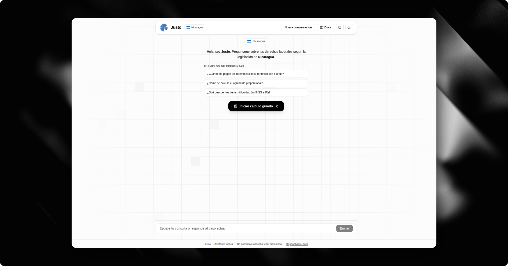

# Justo



Justo is an open source labor assistant for Central America. It provides a conversational labor settlement calculator that explains formulas, references legal basis, and exports a printable PDF with worker and employer signature lines.

## Supported Countries

| Country | Code | Currency | Status |
|---|---|---|---|
| Nicaragua | `ni` | NIO (Córdoba) | ✅ v0.2.0 |
| Guatemala | `gt` | GTQ (Quetzal) | ✅ v0.1.0 |
| Honduras | `hn` | HNL (Lempira) | ✅ v0.1.0 |
| El Salvador | `sv` | USD | ✅ v0.1.0 |
| Costa Rica | `cr` | CRC (Colón) | ✅ v0.1.0 |
| Panamá | `pa` | USD | ✅ v0.1.0 |

## Tech Stack

- Next.js 16 + React 19
- assistant-ui (`@assistant-ui/react`) for chat UI
- Vercel AI SDK v6 (`ai`) + OpenRouter gateway
- Fumadocs for documentation pages
- TypeScript + Tailwind CSS v4
- PDF generation via `pdf-lib`

## Quick Start

### Requirements

- Node.js >= 22.6
- Bun >= 1.3

### Install dependencies

```bash
bun install
```

### Configure environment variables

Copy `.env.example` to `.env.local` and set your OpenRouter key:

```bash
cp .env.example .env.local
```

Required variables:
- `OPENROUTER_API_KEY`
- `OPENROUTER_BASE_URL` (default already provided)
- `OPENROUTER_MODEL`

### Run locally

```bash
bun run dev
```

Open `http://localhost:3000`.

## Project Structure

- `app/` Next.js routes and API endpoints
- `components/chat/` chat interface (LLM + guided liquidation flow)
- `lib/settlement/{ni,gt,hn,sv,cr,pa}/` deterministic settlement logic per jurisdiction
- `lib/pdf/` PDF generation utilities
- `lib/source.tsx` static Fumadocs source for docs pages
- `content/legal/{ni,gt,hn,sv,cr,pa}/` legal corpus per country
- `content/docs/` Fumadocs documentation content

## API Endpoints

- `POST /api/chat` assistant responses via OpenRouter
- `POST /api/liquidation/calculate` deterministic settlement result (routes by `countryCode`)
- `POST /api/liquidation/pdf` printable settlement PDF

## Legal and Safety Notes

- This project is informational and does not constitute legal advice.
- Each jurisdiction uses its own legal corpus (rates, formulas, articles) stored under `content/legal/`.
- Settlement formulas must be verified against current official regulations.
- Complex or disputed cases should be escalated to legal/accounting professionals.

## Open Source Contribution

Contributions are welcome.

1. Fork the repository.
2. Create a branch: `feat/your-change`.
3. Add tests for formula or behavior changes.
4. Open a pull request with context and legal references when applicable.

### Suggested local checks

```bash
bun run typecheck
bun run lint
bun run test
bun run build
```

## Documentation

- App documentation is available at `/docs`.
- Legal source pages per country are available at `/docs/legal/{nicaragua,guatemala,honduras,elsalvador,costarica,panama}`.
- Source legal markdown lives in `content/legal/`.

## Deploy on Vercel

1. Import repository in Vercel.
2. Configure environment variables:
   - `OPENROUTER_API_KEY`
   - `OPENROUTER_BASE_URL`
   - `OPENROUTER_MODEL`
3. Deploy `main` as production branch.

After deploy, verify:
- Legal chat responses work.
- Guided liquidation flow completes for each country.
- PDF download works from result card.

## Roadmap

- Harden legal corpus and deduction rules across all jurisdictions
- Add automated tests for all formula branches per country
- Add thread persistence and case history
- Add support for additional Central American countries
